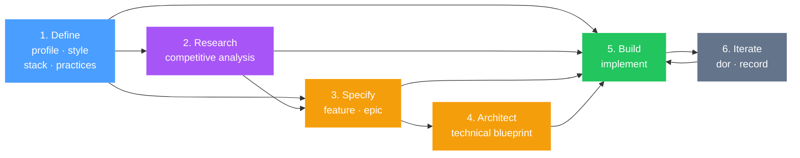

# gspec

**Structured product specifications for AI-assisted development.**

AI coding tools are powerful, but they build better software when they understand *what* you're building and *why*. gspec gives your AI tools that context — a set of living specification documents that define your product, guide implementation, and stay in sync as your project evolves.

Without structured context, AI tools guess. They make assumptions about your audience, your tech stack, your design language, and your quality standards. gspec eliminates that guesswork by creating a shared specification layer that any AI coding tool can read and follow.

## The Problem

Two things go wrong when building with AI:

1. **AI tools lack product context.** They don't know your target audience, your design system, your architectural decisions, or your engineering standards. Every prompt starts from zero.
2. **Specs drift from reality.** Even when you write great specs upfront, they fall out of sync as the project evolves — leading to inconsistency, rework, and compounding confusion.

gspec solves both problems. It provides a structured specification workflow that gives AI tools rich context, and keeps that context accurate as your codebase changes.

## How It Works

gspec installs as a set of slash commands (skills) in your AI coding tool. Each command plays a specific role — business strategist, product manager, architect, designer, engineer — and produces a structured Markdown document in your project's `gspec/` directory.

These documents become the shared context for all subsequent AI interactions. When you implement features, your AI reads the specs. When the code changes, the specs update to match.

### The Workflow

The only commands you *need* are the four fundamentals and `implement`. Everything else exists to help when your project calls for it.

The fundamentals give your AI tool enough context to build well — it knows what the product is, how it should look, what technologies to use, and what engineering standards to follow. From there, `implement` can take a plain-language description and start building. The remaining commands — `research`, `feature`, `epic`, `architect`, `dor`, and `record` — add structure and rigor when the scope or complexity warrants it.



> **Blue** = required foundation. **Purple/Yellow** = optional depth. **Green** = implementation. **Gray** = maintenance.
> Every path starts with Define and passes through Build. The steps in between depend on your project's complexity.

**1. Define the Fundamentals** — Establish the foundation that drives every decision.

| Command | Role | What it produces |
|---|---|---|
| `gspec.profile` | Business Strategist | Product identity, audience, value proposition, positioning |
| `gspec.style` | UI/UX Designer | Visual design language, design tokens, component patterns |
| `gspec.stack` | Software Architect | Technology stack, frameworks, infrastructure, architecture |
| `gspec.practices` | Engineering Lead | Development standards, code quality, testing, workflows |

**2. Research the Market** *(optional)* — Understand the competitive landscape before building.

| Command | Role | What it produces |
|---|---|---|
| `gspec.research` | Product Strategist | Competitive analysis with feature matrix, gap identification, and strategic recommendations |

Use `research` when you want to understand what competitors offer, identify table-stakes features you might be missing, and find differentiation opportunities. It reads competitors from your product profile, produces a persistent `gspec/research.md` file, and can optionally generate feature PRDs from the findings. The `implement` command automatically uses this file when it exists.

**3. Specify What to Build** *(optional)* — Define features and requirements.

| Command | Role | What it produces |
|---|---|---|
| `gspec.feature` | Product Manager | PRD for a single feature with prioritized capabilities |
| `gspec.epic` | Product Manager | Breaks a large epic into multiple feature PRDs with dependency mapping |

Use `feature` when you want a detailed PRD with prioritized capabilities and acceptance criteria before building. Use `epic` when a body of work is large enough to need decomposition into multiple features with dependency mapping. For smaller tasks or rapid prototyping, you can skip straight to `implement` with a plain-language description.

**4. Architect** *(optional)* — Translate specs into a concrete technical blueprint.

| Command | Role | What it produces |
|---|---|---|
| `gspec.architect` | Senior Architect | Technical architecture document with data models, API design, project structure, auth flows, and Mermaid diagrams |

Use `architect` when your feature involves significant technical complexity — new data models, service boundaries, auth flows, or integration points that benefit from upfront design. For straightforward features, `implement` can make sound architectural decisions on its own using your `stack` and `practices` specs.

**5. Build** — Implement with full context.

| Command | Role | What it does |
|---|---|---|
| `gspec.implement` | Senior Engineer | Reads all specs (including research), identifies gaps, plans and builds |

**6. Iterate** *(optional)* — Keep specs and code in sync as the project evolves.

| Command | Role | What it does |
|---|---|---|
| `gspec.dor` | Engineer + Doc Lead | Makes code changes and updates specs to match |
| `gspec.record` | Doc Lead | Updates specs to reflect decisions or changes — no code modifications |

Use `dor` and `record` when you want your specification documents to stay accurate as the project evolves. If you're moving fast and specs are secondary, you can skip them — but as a project matures, keeping specs in sync prevents the context drift that degrades AI output over time.

**Maintenance** — Keep specs up to date with the latest gspec format.

| Command | Role | What it does |
|---|---|---|
| `gspec.migrate` | Migration Specialist | Updates existing gspec documents to the current format when you upgrade gspec, preserving all content |

Each command is self-contained and will ask clarifying questions when essential information is missing.

## Installation

Run from your project root:

```bash
npx gspec
```

The CLI will ask which platform you're installing for:

| Platform | Install path |
|---|---|
| Claude Code | `.claude/skills/` |
| Cursor | `.cursor/commands/` |
| Antigravity | `.agent/skills/` |

You can skip the prompt by passing a target directly:

```bash
npx gspec --target claude
npx gspec --target cursor
npx gspec --target antigravity
```

That's it. The commands are immediately available in your AI tool.

## Output Structure

All specifications live in a `gspec/` directory at your project root:

```
project-root/
└── gspec/
    ├── profile.md          # Product identity and positioning
    ├── style.md            # Visual design language
    ├── stack.md            # Technology stack and architecture
    ├── practices.md        # Development standards
    ├── architecture.md     # Technical architecture blueprint
    ├── research.md         # Competitive analysis and feature gaps
    ├── epics/
    │   └── onboarding-flow.md
    └── features/
        ├── user-authentication.md
        ├── dashboard-analytics.md
        └── ...
```

These are standard Markdown files. They live in your repo, are version-controlled with your code, and are readable by both humans and AI tools.

## Key Design Decisions

**Spec-first development.** Every implementation decision traces back to a specification. AI tools don't guess — they follow documented decisions about your product, stack, design, and standards.

**Living documents.** Specifications aren't write-once artifacts. The `dor` and `record` commands keep them in sync as your project evolves, so they remain a reliable source of truth.

**Role-based commands.** Each command adopts a specific professional perspective — product manager, architect, designer, engineer. This ensures specifications are comprehensive and consider multiple viewpoints.

**Incremental implementation.** Feature PRDs use checkboxes to track which capabilities have been built. The `implement` command reads these to know what's done and what's remaining, so it can be run multiple times as your project grows.

**Competitive research.** The `research` command analyzes competitors named in your product profile, identifying table-stakes features you might be missing and opportunities for differentiation. Its output is saved to `gspec/research.md` and automatically used by `implement` when present.

**Platform-agnostic.** A single set of source commands builds for Claude Code, Cursor, and Antigravity. The build system handles platform-specific formatting so the commands stay consistent across tools.

## Supported Platforms

| Platform | Version | Status |
|---|---|---|
| [Claude Code](https://docs.anthropic.com/en/docs/claude-code) | Skills format | Supported |
| [Cursor](https://www.cursor.com/) | Commands format | Supported |
| [Antigravity](https://www.antigravity.dev/) | Skills format | Supported |

## Project Status

gspec is early-stage and actively evolving. The core workflow is stable, but commands and output formats may change as AI tool capabilities expand and user feedback comes in.

If you run into issues or have ideas, please [open an issue](https://github.com/gballer77/gspec/issues).

## License

[MIT](LICENSE)
