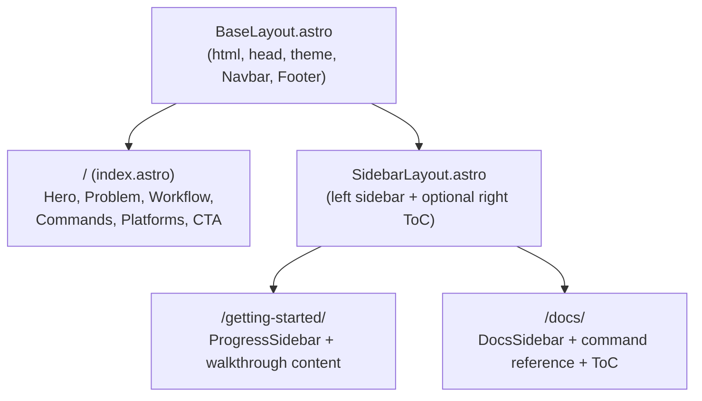

# Technical Architecture

## 1. Overview

The gspec website is a static Astro 5.x site deployed to GitHub Pages. It consists of three pages — a marketing home page, a Getting Started walkthrough, and a command reference (Docs) — sharing a common layout with persistent navigation, dark/light theming, and responsive sidebar patterns.

### Key Architectural Patterns

- **Static Site Generation (SSG)** — All pages are pre-rendered at build time. Zero server-side runtime.
- **Astro component architecture** — Pages and layouts are `.astro` files. No frontend framework islands (React, Vue, etc.) — all interactivity uses vanilla JS via Astro `<script>` tags.
- **Utility-first CSS** — Tailwind CSS v4 with `@tailwindcss/typography` for prose content. Design tokens from `gspec/style.md` mapped to Tailwind theme extensions.
- **File-based routing** — Astro's `src/pages/` directory defines all routes.

### System Boundaries

- **In-scope:** Static HTML/CSS/JS served from GitHub Pages. All content is authored directly in Astro components and Markdown.
- **External:** No APIs, no databases, no authentication, no third-party services beyond GitHub Pages hosting.

### Feature Mapping

| Feature | Pages/Components |
|---------|-----------------|
| Home Page | `src/pages/index.astro`, Hero, ProblemStatement, WorkflowOverview, CommandsOverview, PlatformSupport, BottomCta |
| Getting Started | `src/pages/getting-started.astro`, SidebarLayout, ProgressSidebar, CodeBlock, CopyButton |
| Docs | `src/pages/docs.astro`, SidebarLayout, DocsSidebar, TableOfContents, CodeBlock, CopyButton |
| Shared | BaseLayout, Navbar, MobileMenu, Footer, ThemeToggle |

## 2. Project Structure

### Directory Layout

```
pages/
├── src/
│   ├── pages/                      # Astro file-based routing
│   │   ├── index.astro             # Home page (marketing landing)
│   │   ├── getting-started.astro   # Getting Started walkthrough
│   │   └── docs.astro              # Command reference documentation
│   ├── layouts/                    # Page layout wrappers
│   │   ├── BaseLayout.astro        # Root layout — <html>, <head>, theme setup, Navbar, Footer
│   │   └── SidebarLayout.astro     # Layout with left sidebar + optional right ToC (used by Getting Started & Docs)
│   ├── components/                 # Reusable UI components
│   │   ├── Navbar.astro            # Fixed top navigation bar
│   │   ├── MobileMenu.astro        # Fullscreen mobile navigation overlay
│   │   ├── Footer.astro            # Site footer
│   │   ├── ThemeToggle.astro       # Dark/light mode toggle button
│   │   ├── Hero.astro              # Home page hero section
│   │   ├── ProblemStatement.astro  # Home page problem section
│   │   ├── WorkflowOverview.astro  # Home page workflow diagram section
│   │   ├── CommandsOverview.astro  # Home page commands grid
│   │   ├── PlatformSupport.astro   # Home page platform badges
│   │   ├── BottomCta.astro         # Home page bottom install CTA
│   │   ├── CodeBlock.astro         # Styled code display with optional copy button
│   │   ├── CopyButton.astro        # Copy-to-clipboard button (used in CodeBlock and install CTAs)
│   │   ├── SidebarNav.astro        # Left sidebar navigation with scroll-spy active states
│   │   ├── TableOfContents.astro   # Right-side ToC for wide screens (≥1280px)
│   │   └── CommandSection.astro    # Consistent command reference block (used in Docs)
│   └── styles/                     # Global styles and theme configuration
│       └── global.css              # Tailwind directives, CSS custom properties for theme tokens, font imports
├── public/                         # Static assets
│   ├── favicon.svg                 # Site favicon
│   └── fonts/                      # Self-hosted Inter and JetBrains Mono (subset WOFF2)
├── astro.config.mjs                # Astro configuration (site URL, Tailwind integration)
├── tailwind.config.mjs             # Tailwind theme extensions (colors, fonts, spacing from style guide)
├── package.json                    # Website dependencies (separate from CLI)
└── package-lock.json
```

### File Naming Conventions

- **Components:** `PascalCase.astro` (e.g., `CodeBlock.astro`, `SidebarNav.astro`)
- **Pages:** `kebab-case.astro` (e.g., `getting-started.astro`)
- **Layouts:** `PascalCase.astro` (e.g., `BaseLayout.astro`)
- **Styles:** `kebab-case.css` (e.g., `global.css`)
- **Tests:** Not applicable — static content site per `gspec/practices.md`. Build verification via `astro build` in CI.

### Key File Locations

| Purpose | Path |
|---------|------|
| Entry points (pages) | `src/pages/*.astro` |
| Route definitions | Implicit via Astro file-based routing in `src/pages/` |
| Global styles + theme tokens | `src/styles/global.css` |
| Tailwind design token config | `tailwind.config.mjs` |
| Astro site config | `astro.config.mjs` |
| Static assets | `public/` |

## 3. Data Model

Not Applicable — fully static site with no database or persistent data store.

## 4. API Design

Not Applicable — no API layer. All content is statically rendered.

## 5. Page & Component Architecture

### Page Map

| Route | Page File | Feature | Layout |
|-------|-----------|---------|--------|
| `/` | `src/pages/index.astro` | Home Page | BaseLayout |
| `/getting-started/` | `src/pages/getting-started.astro` | Getting Started | BaseLayout → SidebarLayout |
| `/docs/` | `src/pages/docs.astro` | Docs | BaseLayout → SidebarLayout |



### Shared Components

| Component | Purpose | Used By |
|-----------|---------|---------|
| `Navbar` | Fixed top nav (64px) with logo, nav links, theme toggle, mobile hamburger | All pages (via BaseLayout) |
| `MobileMenu` | Fullscreen overlay menu for mobile viewports | All pages (via Navbar) |
| `Footer` | Site footer with links and copyright | All pages (via BaseLayout) |
| `ThemeToggle` | Dark/light mode toggle button with icon swap | All pages (via Navbar) |
| `CodeBlock` | Styled code display with language badge and optional copy button | Getting Started, Docs |
| `CopyButton` | Copy-to-clipboard with visual feedback (icon swap on success) | Home Page (install CTA), Getting Started, Docs |
| `SidebarNav` | Left sidebar navigation with section links and scroll-spy highlighting | Getting Started, Docs (via SidebarLayout) |
| `TableOfContents` | Right-side ToC auto-generated from page headings, visible ≥1280px | Getting Started, Docs (via SidebarLayout) |
| `CommandSection` | Consistent layout for a single command reference (heading, description, invocation, tips, pitfalls, relations) | Docs |

### Component Patterns

#### Layout Hierarchy

`BaseLayout.astro` wraps every page and provides:
- `<html>` with `data-theme` attribute for theming
- `<head>` with meta tags, font loading, global CSS
- `Navbar` (fixed top)
- `<main>` slot for page content
- `Footer`

`SidebarLayout.astro` nests inside BaseLayout's slot and provides:
- A CSS Grid with three columns: left sidebar (240px) | content (flexible, max `65ch`) | right ToC (200px, ≥1280px only)
- Named slots: `sidebar` (left), `default` (content), `toc` (right)
- On mobile: sidebar and ToC collapse; sidebar becomes accessible via a toggle button within the page
- `scroll-padding-top: 80px` on the content area to account for the fixed navbar when navigating via anchor links

#### Interactivity Pattern

All client-side behavior uses vanilla JS in Astro `<script>` tags — no framework islands needed. Three interactive behaviors exist:

1. **Theme toggle** — Reads/writes `data-theme` on `<html>` and persists preference to `localStorage`. On load: check `localStorage`, fall back to `prefers-color-scheme`, default to dark.
2. **Scroll spy** — An `IntersectionObserver` watches section headings and updates the active state in SidebarNav and TableOfContents. Debounced to avoid rapid toggling.
3. **Copy to clipboard** — `navigator.clipboard.writeText()` with a visual feedback transition (icon swaps from copy to checkmark for 2 seconds).
4. **Mobile menu** — Toggle visibility of MobileMenu overlay, trap focus within it while open, close on Escape key.

#### No Framework Islands

Per `gspec/stack.md`, do not add React/Vue/Svelte islands. The four interactive behaviors above are trivially handled with vanilla JS. Using `client:load` or any framework island would add unnecessary bundle weight to what should be a zero-JS-by-default static site.

### Page-Specific Component Composition

#### Home Page (`index.astro`)

Composed of sequential full-width sections, each its own component:

1. `Hero` — Display heading, Body Large subtitle, CopyButton with install command, secondary ghost button linking to Getting Started
2. `ProblemStatement` — Two-column or stacked layout with the two core problems (AI lacks context, specs drift)
3. `WorkflowOverview` — Visual flow diagram showing Define → Research → Specify → Architect → Analyze → Build → Iterate with required/optional distinction
4. `CommandsOverview` — Card grid (3 columns desktop, 1 mobile) grouping commands by workflow stage. Each card: icon, command name, role, one-line description
5. `PlatformSupport` — Row of platform names/logos: Claude Code, Cursor, Antigravity, Codex
6. `BottomCta` — Centered section with heading, install command CopyButton, link to Getting Started

#### Getting Started (`getting-started.astro`)

Uses SidebarLayout. Left sidebar contains a `SidebarNav` with entries for each walkthrough section. Right ToC auto-generated from H2/H3 headings. Content is authored inline in the Astro file as a sequence of sections:

- Example project introduction
- Install
- Profile (with abbreviated output in CodeBlock)
- Style
- Stack
- Practices
- Feature
- Implement (with abbreviated output in CodeBlock)
- Next steps

#### Docs (`docs.astro`)

Uses SidebarLayout. Left sidebar contains a `SidebarNav` grouped by workflow stage. Right ToC auto-generated from headings. Content uses `CommandSection` components for each of the 11 commands, ensuring consistent structure:

- Workflow Overview (introductory section with visual diagram)
- Define: profile, style, stack, practices
- Research: research
- Specify: feature, epic
- Architect: architect
- Analyze: analyze
- Build: implement
- Maintenance: migrate

Each `CommandSection` renders with consistent sub-headings: What it does, When to use it, What it produces, Example invocation (CodeBlock), Key questions, Best practices, Common pitfalls, Related commands.

## 6. Service & Integration Architecture

Not Applicable — no backend services, no external integrations, no background jobs.

## 7. Authentication & Authorization Architecture

Not Applicable — public static site with no user accounts or protected resources.

## 8. Environment & Configuration

### Environment Variables

No environment variables required for local development or production. The site is fully static with no secrets.

The only configuration that varies by environment is the `site` URL in `astro.config.mjs`:
- **Local dev:** `http://localhost:4321` (Astro default)
- **Production:** The GitHub Pages URL (configured in `astro.config.mjs`)

### Configuration Files

| File | Purpose | Notable Settings |
|------|---------|-----------------|
| `astro.config.mjs` | Astro site configuration | `site` URL for GitHub Pages, `integrations: [tailwind()]`, `output: 'static'` |
| `tailwind.config.mjs` | Tailwind theme extensions | Custom colors (primary, secondary, neutral, semantic), font families (Inter, JetBrains Mono), spacing scale, border radius tokens — all mapped from `gspec/style.md` |
| `package.json` | Website dependencies | `astro`, `@astrojs/tailwind`, `tailwindcss`, `@tailwindcss/typography` |

#### Tailwind Theme Configuration

The `tailwind.config.mjs` must map all design tokens from `gspec/style.md`:

```js
export default {
  content: ['./src/**/*.{astro,html,js,md,mdx}'],
  darkMode: ['selector', '[data-theme="dark"]'],
  theme: {
    extend: {
      colors: {
        primary: {
          300: '#C4B5FD',
          400: '#A78BFA',
          500: '#8B5CF6',
          600: '#7C3AED',
          900: '#1E1338',
        },
        secondary: {
          400: '#22D3EE',
          500: '#06B6D4',
          600: '#0891B2',
        },
        neutral: {
          50: '#F8F8FC',
          100: '#EDEDF4',
          200: '#D4D4E0',
          300: '#B8B8CC',
          400: '#9494A8',
          500: '#6B6B80',
          600: '#4A4A5A',
          700: '#2E2E3A',
          800: '#1E1E26',
          900: '#131318',
          950: '#0A0A0F',
        },
        success: '#34D399',
        warning: '#FBBF24',
        error: '#F87171',
        info: '#60A5FA',
      },
      fontFamily: {
        sans: ['Inter', 'system-ui', '-apple-system', 'sans-serif'],
        mono: ['JetBrains Mono', 'ui-monospace', 'Cascadia Code', 'Fira Code', 'monospace'],
      },
      borderRadius: {
        sm: '4px',
        md: '8px',
        lg: '12px',
        xl: '16px',
      },
      maxWidth: {
        prose: '65ch',
      },
    },
  },
  plugins: [require('@tailwindcss/typography')],
}
```

#### Global CSS Structure (`src/styles/global.css`)

```css
@tailwind base;
@tailwind components;
@tailwind utilities;

/* Theme tokens as CSS custom properties for runtime theme switching */
[data-theme="dark"] {
  --bg-page: theme('colors.neutral.950');
  --bg-surface: theme('colors.neutral.900');
  --bg-surface-raised: theme('colors.neutral.800');
  --text-primary: theme('colors.neutral.100');
  --text-body: theme('colors.neutral.200');
  --text-secondary: theme('colors.neutral.400');
  --text-muted: theme('colors.neutral.500');
  --border-default: theme('colors.neutral.700');
  --border-subtle: theme('colors.neutral.800');
}

[data-theme="light"] {
  --bg-page: theme('colors.neutral.50');
  --bg-surface: #FFFFFF;
  --bg-surface-raised: theme('colors.neutral.100');
  --text-primary: theme('colors.neutral.950');
  --text-body: theme('colors.neutral.800');
  --text-secondary: theme('colors.neutral.600');
  --text-muted: theme('colors.neutral.500');
  --border-default: theme('colors.neutral.300');
  --border-subtle: theme('colors.neutral.200');
}
```

#### Theme Toggle Script Pattern

```js
// Inline in <head> via BaseLayout to prevent flash of wrong theme
const stored = localStorage.getItem('theme');
const preferred = window.matchMedia('(prefers-color-scheme: light)').matches ? 'light' : 'dark';
document.documentElement.setAttribute('data-theme', stored || preferred);
```

### Project Setup

```bash
# From project root
cd pages
npm install

# Local development
npm run dev          # Starts Astro dev server at localhost:4321

# Production build
npm run build        # Outputs static files to dist/

# Preview production build locally
npm run preview      # Serves dist/ at localhost:4321
```

#### Key Dependencies

```json
{
  "dependencies": {
    "astro": "^5.0.0",
    "@astrojs/tailwind": "^6.0.0",
    "tailwindcss": "^4.0.0",
    "@tailwindcss/typography": "^0.5.0"
  },
  "devDependencies": {
    "prettier": "^3.0.0",
    "prettier-plugin-astro": "^0.14.0"
  }
}
```

### CI/CD — GitHub Actions

A single workflow handles build and deploy:

- **Trigger:** Push to `main` when files under `pages/` change, or PRs to `main` touching `pages/`
- **Build step:** Checkout → setup Node 20 → `cd pages && npm ci && npm run build`
- **Deploy step (main only):** Deploy `pages/dist/` to GitHub Pages via `actions/deploy-pages`
- Path filtering ensures CLI-only changes don't trigger website builds

## 9. Technical Gap Analysis

### Identified Gaps

**Gap 1: Home page dark/light mode toggle contradicts feature PRD**

- **What's missing:** The home page PRD lists "Dark/light mode toggle" as deferred, but the user has decided to include it from the start.
- **Why it matters:** The implementing agent would skip the toggle if following the PRD literally.
- **Proposed solution:** The home page PRD's "Deferred" section should be updated to remove the dark/light mode toggle item, and a capability should be added for the theme toggle across all pages.
- **Resolution:** Architecture overrides the deferral — implement the toggle as part of the shared Navbar component in BaseLayout, available on all pages from day one.

**Gap 2: Scroll-spy behavior not specified in PRDs**

- **What's missing:** Both Getting Started and Docs PRDs say the sidebar highlights the current section, but don't specify the mechanism or edge cases (what happens at page top/bottom, debouncing, behavior when clicking a sidebar link).
- **Why it matters:** Without guidance, the implementing agent may produce a janky scroll-spy that rapidly toggles between sections near boundaries.
- **Proposed solution:** Use `IntersectionObserver` with `rootMargin: '-80px 0px -60% 0px'` (accounts for fixed navbar, biases toward the top of the viewport). When a sidebar link is clicked, temporarily disable the observer for 100ms to avoid the highlight jumping during the smooth scroll. At page bottom, activate the last section.
- **Resolution:** Specified here for the implementing agent.

**Gap 3: Mobile sidebar behavior unspecified**

- **What's missing:** Getting Started PRD says sidebar "collapses or adapts on smaller screens" but doesn't specify how. Docs PRD says the same.
- **Why it matters:** The implementing agent needs a concrete pattern.
- **Proposed solution:** On viewports below 1024px, the left sidebar is hidden by default and accessible via a floating button (bottom-left, icon: list/menu) that slides the sidebar in as an overlay. The right ToC is hidden entirely below 1280px. This avoids cluttering the mobile layout while keeping navigation accessible.
- **Resolution:** Specified here for the implementing agent.

**Gap 4: Workflow diagram implementation on home page**

- **What's missing:** The home page PRD specifies a workflow overview section but doesn't specify whether the diagram is an image, SVG, Mermaid render, or HTML/CSS.
- **Why it matters:** Mermaid requires a JS library at runtime (contradicts zero-JS goal). A static image is simple but not theme-aware.
- **Proposed solution:** Build the workflow diagram as an HTML/CSS component using Tailwind utilities — colored boxes with labels connected by CSS borders or SVG arrows. This is theme-aware, responsive, zero-JS, and matches the style guide exactly. No Mermaid runtime needed.
- **Resolution:** Implement as an HTML/CSS component.

**Gap 5: Font loading strategy**

- **What's missing:** The style guide specifies Inter and JetBrains Mono from Google Fonts, but the stack doesn't specify whether to use Google Fonts CDN or self-host.
- **Why it matters:** Google Fonts adds an external dependency and a render-blocking request. Self-hosting gives better performance and privacy.
- **Proposed solution:** Self-host subset WOFF2 files in `public/fonts/`. Use `font-display: swap` to prevent layout shift. Subset to Latin characters only to minimize file size. This aligns with the performance goal (perfect Lighthouse scores) and avoids external dependencies.
- **Resolution:** Self-host fonts.

**Gap 6: Copy-to-clipboard feedback**

- **What's missing:** The home page PRD says "a copy-to-clipboard interaction is available" but doesn't specify the feedback mechanism.
- **Why it matters:** Without visual feedback, users won't know if the copy succeeded.
- **Proposed solution:** The CopyButton component shows a clipboard icon by default. On click, it copies the text, swaps the icon to a checkmark with a brief color transition (to `success` green), and reverts after 2 seconds. Uses `navigator.clipboard.writeText()` with a fallback to the legacy `document.execCommand('copy')` for older browsers.
- **Resolution:** Specified here for the implementing agent.

### Assumptions

- **Astro Tailwind integration version:** Assuming `@astrojs/tailwind` v6+ is compatible with Tailwind CSS v4. If the integration hasn't been updated for v4 yet, use Tailwind's native Vite plugin (`@tailwindcss/vite`) directly instead.
- **GitHub Pages base path:** Assuming the site is deployed at the root of a custom domain or `<username>.github.io/<repo>` — the `base` path in `astro.config.mjs` may need adjustment depending on the deployment URL.
- **No client-side routing:** Astro uses full page navigations by default. View Transitions API is not included — each page is a full HTML document load. This is fine for 3 pages.

## 10. Open Decisions

- **GitHub Pages deployment URL:** The `site` and `base` values in `astro.config.mjs` depend on whether the site uses a custom domain or the default `github.io` path. This should be confirmed before the first deploy.
- **Tailwind CSS v4 + Astro integration compatibility:** If `@astrojs/tailwind` doesn't yet support Tailwind v4, the architecture falls back to using `@tailwindcss/vite` as a Vite plugin in `astro.config.mjs` instead. The implementing agent should check compatibility at build time and adapt.
- **Font subsetting:** The exact character subset for Inter and JetBrains Mono should be determined during implementation. Latin-only is the starting point; extend if the content includes non-Latin characters.
